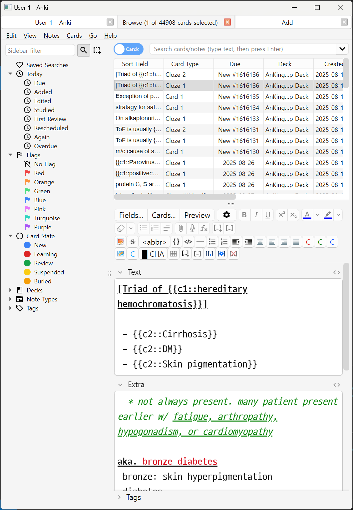
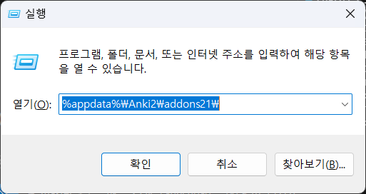

# Tabbed Anki

Manage various anki windows with tabs. Useful when reviewing in small form factor screens. I hope anki add this upstream!



## How to install

* Prerequisite
  * Python 3
  * node.js

```sh
git clone https://github.com/trgkanki/tabbed-anki/
cd tabbed-anki
npm i
npm run link
```

# Manual uninstall guide

Since this addon touches the core UI of Anki, it might break something that **bricks the Anki itself**. It had been reported that some users were not even able to access addon manager window due to the malfunctioning addon. So before this addon comes out of the alpha, I'll leave the manual uninstallation method here.

> Manual below is for Windows OS. For macOS/linux users, amend the path appropriately.

1. With `Win+R`, open the path `%AppData%\Anki2\addons21\` 
2. Remove the folder `916531152` (if you installed it from AnkiWeb) or `tabbed-anki` (if you git cloned the repo)
