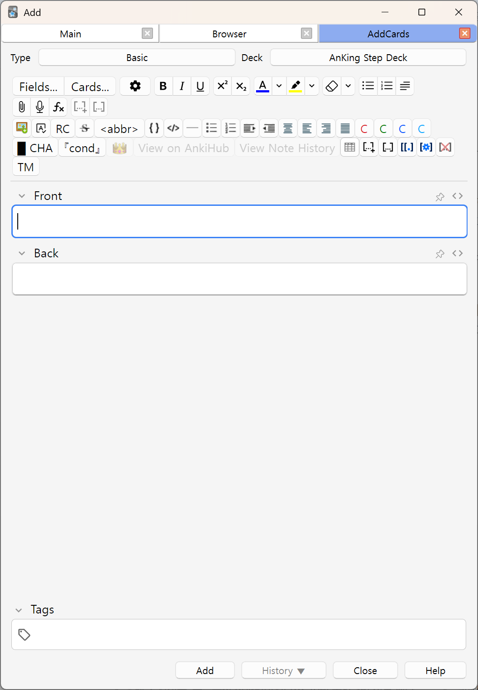

# Tabbed Anki

Manage various anki windows with tabs. Useful when reviewing in small form factor screens or split screens.



## How to install

* Prerequisite
  * Python 3
  * node.js

```sh
git clone https://github.com/trgkanki/tabbed-anki/
cd tabbed-anki
npm i
npm run link
```
